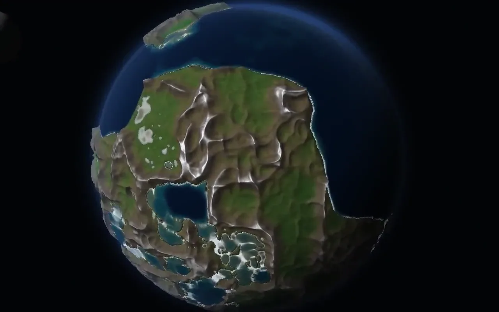
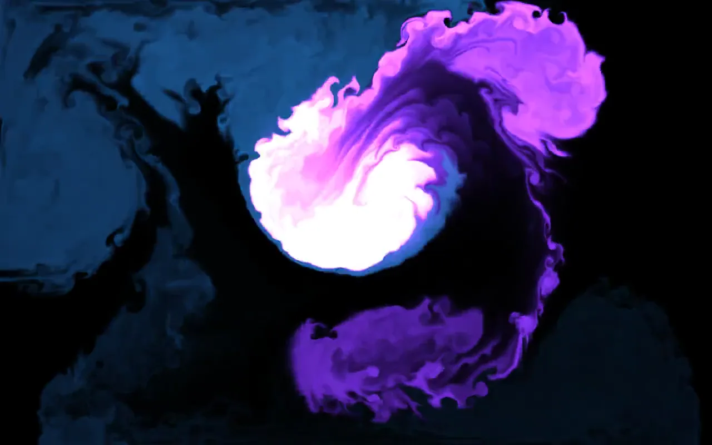
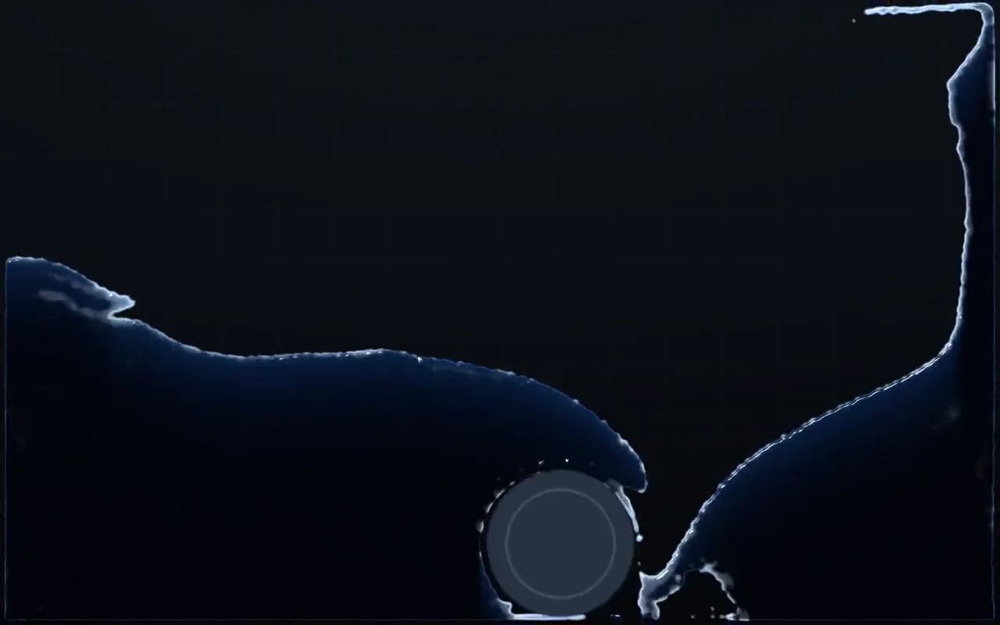
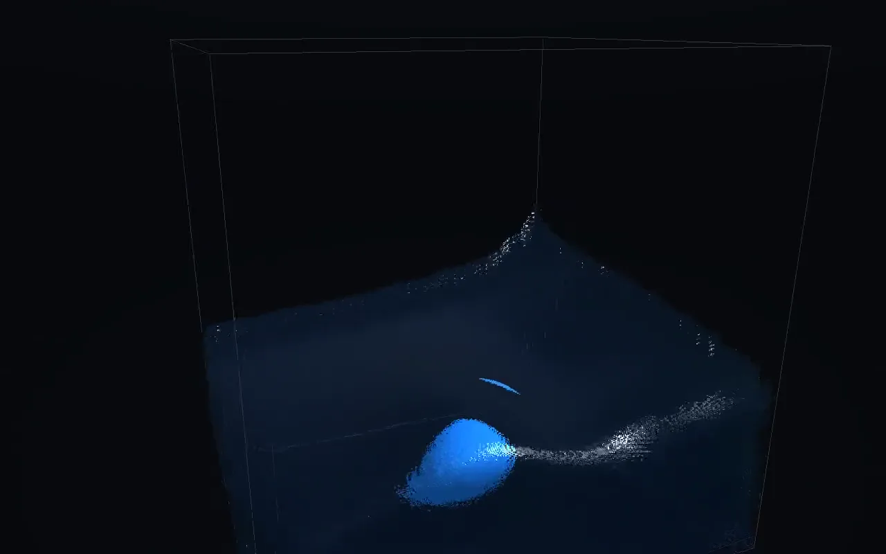
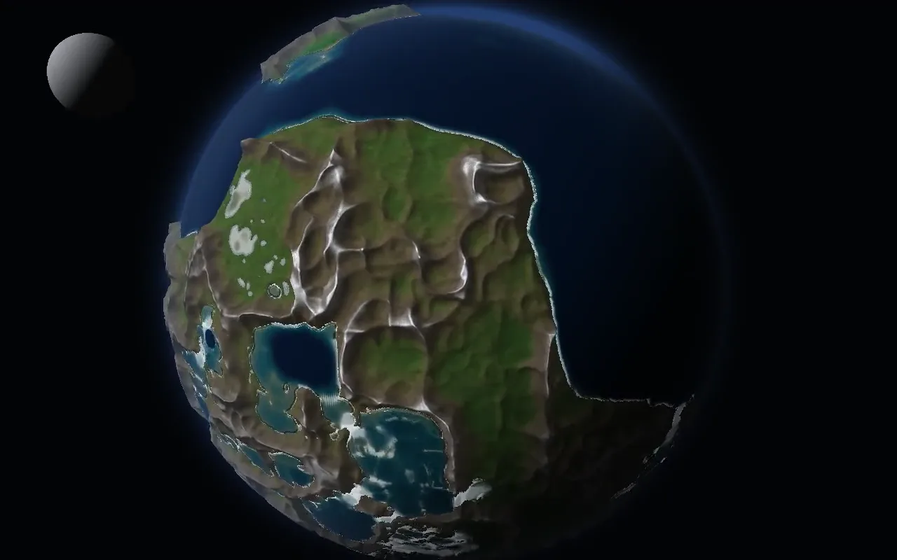

<!-- portfolio:begin -->
<!-- ここから portfolio:end までは自動生成です。直接編集しても次の生成で消えます。
     原本 : portfolio-site/src/data/projects.ts （slug: fluid-lab）
     生成 : cd portfolio-site && npm run docs:emit
     点検 : cd portfolio-site && npm run check
     マーカーの外（ライセンス・クレジットなど）は手書きのまま残ります -->

# Fluid Lab

> インク・水2D・水3D・惑星の4モードをWebGL2で書いた流体シミュレーション

**[▶ デモ](https://kosei-matsuzaki.github.io/fluid-lab/)** ・ **[作品ページ（動画つき）](https://kosei-matsuzaki.github.io/portfolio/works/fluid-lab/)** ・ **[開発者向けドキュメント](docs/README.md)**

| 項目 | 内容 |
| --- | --- |
| 期間 | 2026年8月 |
| 体制 | 個人開発（ソルバ・レンダリング・UI すべて） |
| 使用技術 | JavaScript / WebGL2 / GLSL / FLIP/PIC 法 / 球面浅水方程式 / スクリーンスペース流体レンダリング / GitHub Pages |
| インク / 水2D / 水3D / 地球を1画面で切替 | 4モード |
| 外部ライブラリ依存（成果物は単一 HTML 219KB） | 0 |
| 全球シミュレーションの格子（2048×1024） | 約200万セル |

> **注記** — WebGL2 が必要です。フル品質には `EXT_color_buffer_float` が要り、非対応環境では CPU フォールバックで動作します。マウス操作前提のためデスクトップ推奨。

2D Stable Fluids・FLIP/PIC 法の水槽（2D / 3D）・球面浅水方程式による全球の海という、性質の違う4つの流体ソルバを実装して1画面で切り替えられるようにしました。ライブラリを一切使わず、GLSL を文字列で書いて WebGL2 に載せ、成果物は依存ゼロの単一 HTML ファイルとして配布しています。

*4つのモードの実動作（無音・ループ）。すべてブラウザ上でリアルタイムに解いている*

**見どころ**

- 格子法（Stable Fluids）と粒子・格子ハイブリッド（FLIP/PIC）の両方を、2D・3D それぞれで実装
- 水面はメッシュを作らず、深度 → 分離ブラー → 厚み → 屈折・Beer–Lambert の順にスクリーンスペースで合成
- GLSL は `node --check` では検証できないため、ヘッドレス Chromium で全モードを走らせるスモークテストを用意した

## 4つのモード

「流体」と一口に言っても、表現したいものによって適した解き方が違います。混ざり合う煙やインクは格子法が向き、水面が割れて飛沫が飛ぶ表現は粒子と格子を往復させる方法が向きます。その違いを自分で確かめたかったので、同じ UI の中に性質の異なる4つのソルバを並べました。

### インク（2D Stable Fluids・GPU）

ドラッグの軌跡に沿って発光インクを流し込む格子法の流体。渦度強化（vorticity confinement）で、数値粘性に潰される小さな渦を復元している

*ドラッグ2回ぶんのインクが、渦を生みながら混ざっていく*

### 水 2D（FLIP/PIC）

粒子と MAC グリッドを往復させる水槽。水面はメタボールで抜くので、砕けた飛沫がそのまま粒として分離する

*リセット直後のダムブレイク。壁を駆け上がった水が砕けて粒に分かれる*

### 水 3D（3D FLIP + SSFR）

立体の水槽。ポリゴンの水面メッシュを作らず、スクリーンスペース流体レンダリングで水面を描く。球体でかき混ぜられる

*球体が水をかき混ぜ、後ろに泡の尾を引く。水面はメッシュを作らず画面空間で描いている*

### 地球（球面浅水方程式）

全球の海を回す惑星モード。地形は毎回手続き生成され、雨は川になって流れ下る。月と太陽の潮汐、コリオリ力、自転軸の傾きによる季節つき

*雨を降らせた惑星。昼夜境界・大気の縁光・月まで、シミュレーション時刻に同期している*

## FLIP/PIC — 粒子と格子を往復させる

FLIP/PIC 法は、速度を粒子に持たせつつ、非圧縮条件（圧力射影）は格子上で解くハイブリッドです。粒子→格子（P2G）と格子→粒子（G2P）の転送を毎ステップ行い、圧力は過緩和係数 1.9 の Gauss–Seidel 法で解いています。

実装で一番はまったのは、FLIP の速度差分に使う「前フレームの格子速度」をどの時点で保存するかでした。粒子→格子転送の後・圧力射影の前で取らないと、差分に自分自身の更新が混ざって毎フレーム増幅し、数十フレームで発散します。原因が数式ではなく処理順序にあるタイプのバグで、式を何度見直しても見つかりませんでした。

### 静止時のドリフト

微小な速度が積み上がって水面が揺れ続ける問題に、ドリフト補正のデッドバンドを入れて止めた

### 壁への貼り付き

境界で速度を全成分固定すると壁に貼り付く（No-Slip 相当になる）ため、壁に向かう流束だけを止める方向性クランプに変更した

## 球面浅水方程式 — 惑星の海を回す

地球モードでは、緯度経度 2048×1024 の格子上で状態 (h, u, v) を WebGL2 のフラグメントシェーダでピンポン求積しています。運動量方程式に自由表面勾配・潮汐加速度（月に加えて太陽を 0.45 倍で重畳）・コリオリ力を入れ、連続の式は風上流束と球面の計量で解いています。極は緯度方向に折り返すミラー処理で扱いました。

重力波の CFL 条件は水深と重力加速度で決まるため、UI の重力スライダーを動かすと簡単に破綻します。そこで毎フレーム CFL からサブステップ数を計算し、スライダーをどこまで振っても壊れないようにしています。

## 地形生成と描画

### 大陸

低周波 fbm を分位点で正規化し、シードによらず陸地率が約48%になるよう保証する

### 川

山の湧点から最急降下を追跡して谷を彫る。逐次処理なのでここだけ CPU で、ノイズ合成（約200万セル）は GPU で回して readPixels で読み戻してから刻む

### 海面

球面のハイトフィールドをレイマーチ＋二分法で交差判定する。法線は B スプライン双三次サンプリングで取り、バイリニア由来のセル状のファセットを消した

### 波・泡

尖った波頭の方向性波6本に風のむらを乗せ、白波・流速由来の泡・海岸の泡線を重ねる。格子より細かいディテールはカメラが近づくとフェードインする

## 単一 HTML に収める

配布物は依存ライブラリなしの単一 HTML ファイルです（219KB）。ただし4,300行を1ファイルで書くのは読めたものではないので、ソースは役割ごとに `src/` へ分割し、`node build.js` で決定的に連結して `fluid-lab.html` を組み立てる構成にしました。ビルドスクリプト自体も依存ゼロの単純なスプライスです。

## GLSL をどう検証するか

JavaScript の構文エラーは `node --check` で落とせますが、文字列に埋め込んだ GLSL は素通りします。実際、GLSL の予約語 `patch` を変数名に使ってしまい、全モードが起動しなくなる事故を起こしました。

そこで、ヘッドレス Chromium（`--enable-unsafe-swiftshader`）で全モードを順に生成して数フレーム進めるスモークテストを用意し、シェーダを触ったときは必ず通すようにしています。紹介ページに載せた各モードのスクリーンショットも、同じ仕組みで UI を隠して撮ったものです。

## 生成 AI の活用について

- 実装したい手法（Stable Fluids・FLIP/PIC・球面浅水方程式・SSFR）と、モード構成・UI の設計は自分が決めた
- 発散・貼り付き・ドリフトといった不具合は現象から原因を切り分けたうえで指示し、AI には実装とパラメータ調整の試行を担当させた
- シェーダを触るたびにヘッドレス Chromium のスモークテストを通す運用を決め、目視でしか判定できない見た目の受け入れは自分で行った

---

動かし方・設計資料・開発メモは **[docs/README.md](docs/README.md)** にまとめています。  
動画つきの詳しい版: https://kosei-matsuzaki.github.io/portfolio/works/fluid-lab/  
デモ: https://kosei-matsuzaki.github.io/fluid-lab/

<!-- portfolio:end -->
